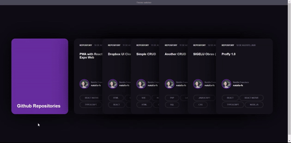

# Cards animados com CSS

## Site simples feito para estudar HTML e animações com CSS, inspirado neste [vídeo](https://youtu.be/r6Zt9vaRt3E).

### O que aprendi e pratiquei com esse projeto:

* Flexbox
* Transitions
* Armazenamento e recuperação de variáveis no Local Storage

# Preview

